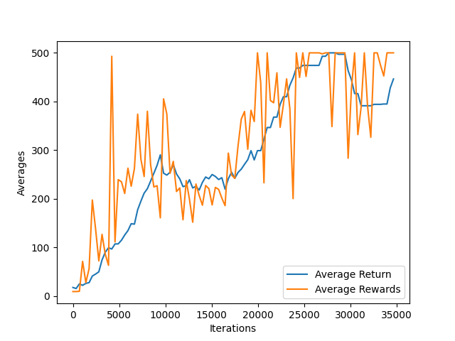
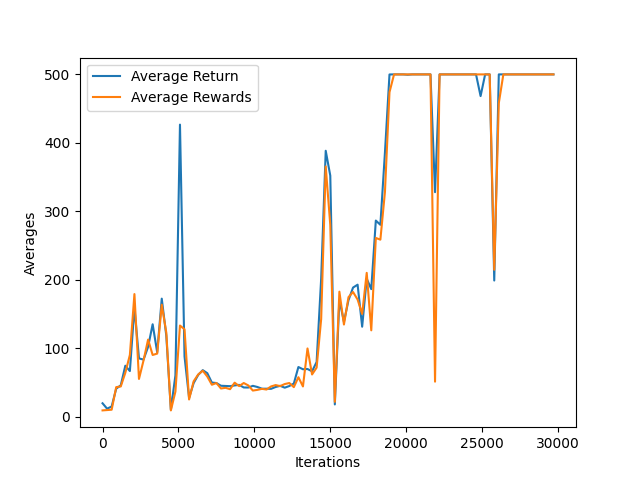
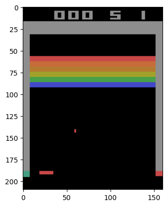
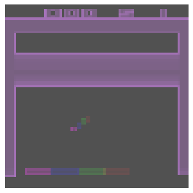
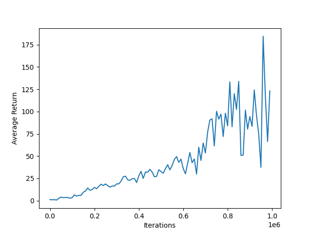
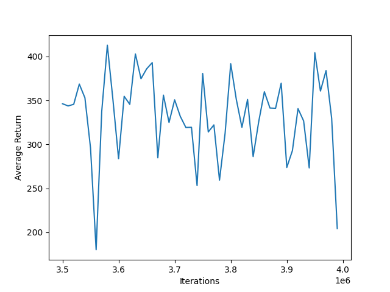

# RL-Projects

## 1. Policy Gradients

* I have used the CartPole gym environment to implement the PG algorithm.  
* PG algorithms optimize the policy by following the gradients towards higher rewards. I used the famous **Reinforce Algorithm**.  
* Here a neural network first explores the environment by predicting actions and also computes the gradients.  
* After running several episodes, we calculate each action's advantage for each episode so that every action has weights according to the future rewards.  
* Then compute the reward weighted mean for the gradient vectors for each training variable.  
* Finally perform the gradient descent step to update the variables.
* It took around **100 training** iteration to train the model.
* This algorithm is easy to implement but it is difficult to scale for complex environments.
  
## 2. Deep Q Learning

* This algorithm is based on the concept of **Markov Decision Process** which is a stochastic process.
* Along with Bellman's equation, we can compute **State value (V)** and **State-action value (Q)**
* Given a policy, V is good to evaluate the policy, but it does not give the best policy for the agent.
* With the Q values we can get the optimal policy for the agent.
* In Deep Q Learning, we try to train a network that gives the best Q values to perform an action for a given state.
* While we explore the environment with **epsilon greedy policy**, the agent saves every experience (current observations and the next state) to the **replay buffer**.
* During each iteration the agent is trained with a sample of experiences from the replay buffer. We can compute the target Q value using Bellman's equation, then predict the model's Q value and calculate the loss.
* Compute and apply the gradients to update the variables.
* It took around 2000 iterations to train.

* As it can be seen in the above image the rewards reaches to 250 which is max in this environment, but there is instability as the reward suddenly drops sometimes. This is called **Catastrophic forgetting** and it is because of what the agent learned in one part of env may not work in another part of env.
* To overcome this we can use large replay buffers and small learning rates.
* The problem with this algorithm is that the same model which is being trained is used to predict the next Q values for the calculation of the Q target in Bellman's equation. This creates a kind of feedback loop which may diverge, oscillate or freeze.

## 3. DQL with fixed Q targets

* This algorithm is a little improvement over basic DQL.
* Here two models are used - **Online Model** and **Target Model**
* The online model is the one that is being trained to predict the Q values.
* The target model is introduced just to calculate the Q target values.
* It is a clone of the online model, but the weights of the online model are copied at regular intervals while training.
  

* Since the target model is updated much less often so the feedback loop is damped.

## 4. Double DQN

* This is also another improvement to stabilize the training and increase the performance.
* This update is based on the observation the target model overestimates the Q target values because they are approximations and for equally good action, one Q value will be greater than the other and overestimated.
* So the online model is first used to select the best action corresponding to max Q values for next state and then target model is used to select the Q values corresponding to those actions.

* This algorithm is trained much faster and is much more stable.

# TF Agents

The TF-Agents library is a Reinforcement Learning library based on Tensorflow. It implements the above-discussed algorithms along with many more. It also provides the various RL components which are efficient, scalable and customizable. It provides a training architecture to implement any algorithm with tf agents.  
The architecture is divided into two parts that run in parallel:
* Collection
  + Collect Policy
  + Collect Driver
  + Environments
  + Observers
  + Replay Buffers
* Training
  + Agent
  + Networks
  + Dataset

### The architecture is usually set like this with DQN

* A **DQN** agent will be trained for an environment with **Deep Q Network** in the backend.
* Tf agents provide a **uniform replay buffer** which will be populated with experiences during environment exploration by the **collect driver**.
* Between the replay buffer and collect driver there is an **observer** who will write the experiences coming from the driver to the replay buffer.
* For the collect driver, we have **Dynamic Step Driver** and **Dynamic Episode Driver** which run a step and episode in the environment respectively.
* A **Dataset** is defined to collect a sample of experiences from the replay buffer and pass it to the agent for training.
* To train the agent, for each training step, a collect driver runs, experiences are fetched from the dataset and the agent is trained with these experiences.
* To observe the training process, we can log **tf_metrics** or the rewards by testing the agent at regular intervals.
* The choice of the driver depends on the specific training goals. 
* Step driver has fine-grained control and has consistent data flow which allows the number of steps to be collected and it is useful for steady and incremental training.
* Episode driver is useful for learning policies that requires full episode but it can be unstable as full episode data is collected in one training step.

## 5. CartPole Env with DQN

The agent is trained for the CartPole-v1 environment with tf_agents.
### With Dynamic Step Driver

https://github.com/anmol438/RL-Projects/assets/50985412/db72afa5-7279-4e5a-9746-0e4b94fc0497

### With Dynamic Episode Driver

https://github.com/anmol438/RL-Projects/assets/50985412/c4608f7f-0065-4d5a-b531-7c95795fb32d

* The agent is well-trained and performed perfectly.
* If we look at average return, with the step driver the training is smooth while with the episode driver it is unsteady.

## 6. Atari - Breakout Env

* Using the DeepMind paper from 2013 (https://homl.info/dqn) and the TensorFlow's training architecture implemented in the TF-Agent package, I trained a DQN agent to play the Atari-Breakout game (https://gymnasium.farama.org/environments/atari/breakout/).
* This env is not as simple as CartPole env. So I will explain it in a little detail.
* The Atari env needs to be installed separately for the gym. Please read **"./6-BreakoutAtari-tf_agents-DQN/readme.md"** for installation help.
* The raw Breakout env looks like this:  
  
* For efficient training, the grayscaled and framestacked environment is good. After preprocessing it looks like this:  
  
* Four colours represent four consecutive different frames.
* The **Q-network** is set up with a normalized layer, a convolutional layer and then a dense layer.
* This network is feed in the **DQN agent** with **epsilon greedy policy**.
* **Dynamic Step Driver** explores the environment and collects trajectories to **replay buffer**.
* It took around 4 days of training for **4 million** steps to make the agent perform excellently.
* I also used the **Checkpoint** which stores the trained state to the hard disk. If something wrong happens during the training, it can be restored from the last checkpoint.
* **Policy Saver** can be used to play in the environment with the trained agent's policy.
* I regularly observed the training and also evaluated the agent during the training.
* Below are the observations:
#### Initial Phase:
* Average Return  
  
* Training Video

https://github.com/anmol438/RL-Projects/assets/50985412/74b2dc1a-5eb9-4690-af02-82518a74dce8

* Agent Evaluation Video:

https://github.com/anmol438/RL-Projects/assets/50985412/97ecb9df-cc00-4f01-96d3-c86a10f0c29e

#### At 4 million steps:
* Average Return  
  
* Training Video

https://github.com/anmol438/RL-Projects/assets/50985412/92ee5f39-a004-4f1f-95fc-2d117377397c

* Agent Evaluation Video:

https://github.com/anmol438/RL-Projects/assets/50985412/5276754e-2999-4d45-af98-8fe42de77105

During the initial training phase, the agent began to understand that moving the paddle to hit the ball and break the brick walls was crucial. As training progressed, it was fascinating to witness the agent achieving superhuman capabilities. It discovered an advanced strategy: digging a tunnel through the brick walls for maximum scoring, allowing the ball to bounce behind the walls and rack up points effortlessly.  
My agent got an impressive maximum evaluation score of 419 and a training score of 424 during the training. For context, the maximum evaluation score reported in the (https://www.nature.com/articles/nature14236) article is 428.  
There's still room for improvement to consistently break all the bricks and achieve the maximum score.
